**SENG 637 - Dependability and Reliability of Software Systems**

**Lab. Report \#4 – Mutation Testing and Web app testing**

| Group 4      |
|-----------------|
| Zohara Kamal            |   
| Thanoshan Vijayanandan          |   
| Minh Le                |   
| Shuvam Agarwala              |

# 1. Introduction

# 2. Analysis of 10 Mutants of the Range class 

# 3. Report all the statistics and the mutation score for each test class
### Test suite access
* The **final (updated) test suite** of **Range class** can be found here: JFreeChart_Lab4/src/org/jfree/data/rangetest
* The **final (updated) test suite** of **DataUtilities class** can be found here: JFreeChart_Lab4/src/org/jfree/data/datautilitiestest
* The **original test suite** of **Range class** can be found here: JFreeChart_Lab4/src/org/jfree/data/rangetestbefore
* The **original test suite** of **DataUtilities class** can be found here: JFreeChart_Lab4/src/org/jfree/data/datautilitiestestbefore

Please note that, since we have commented out dead code identified by our test cases in the source code of Range and DataUtilities class, the original test suite's mutation score can be higher than the reported score (as it has reduced the no coverage code).

## 3.1 Range class
### 3.1.1 Before
#### Mutation score
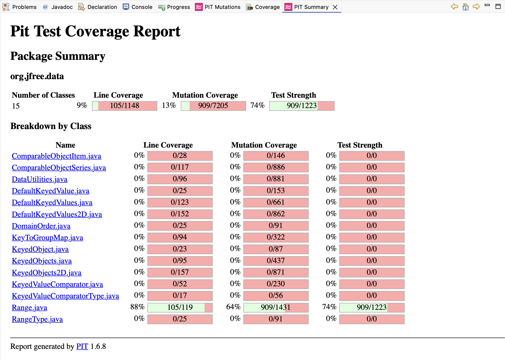

#### Mutation statistics
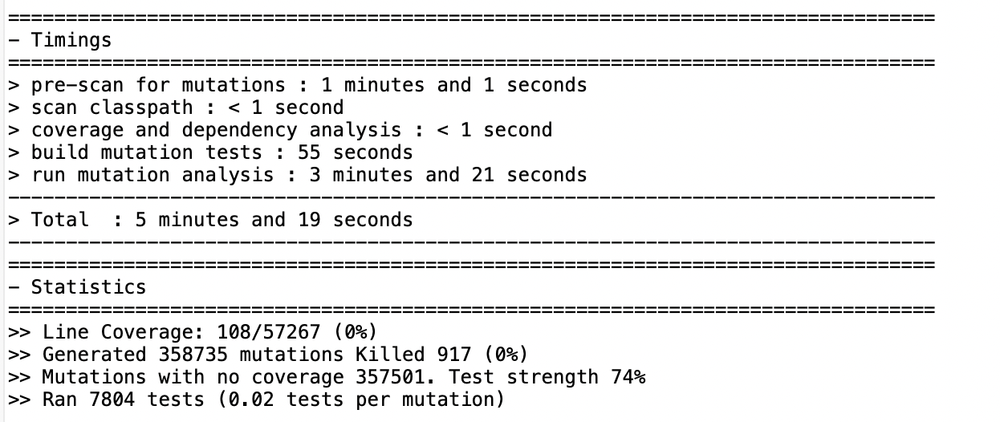
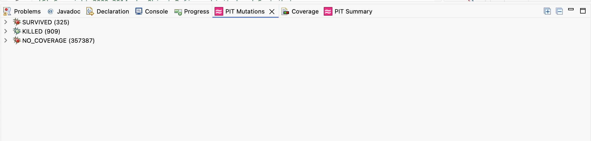

### 3.1.2 After
#### Mutation score
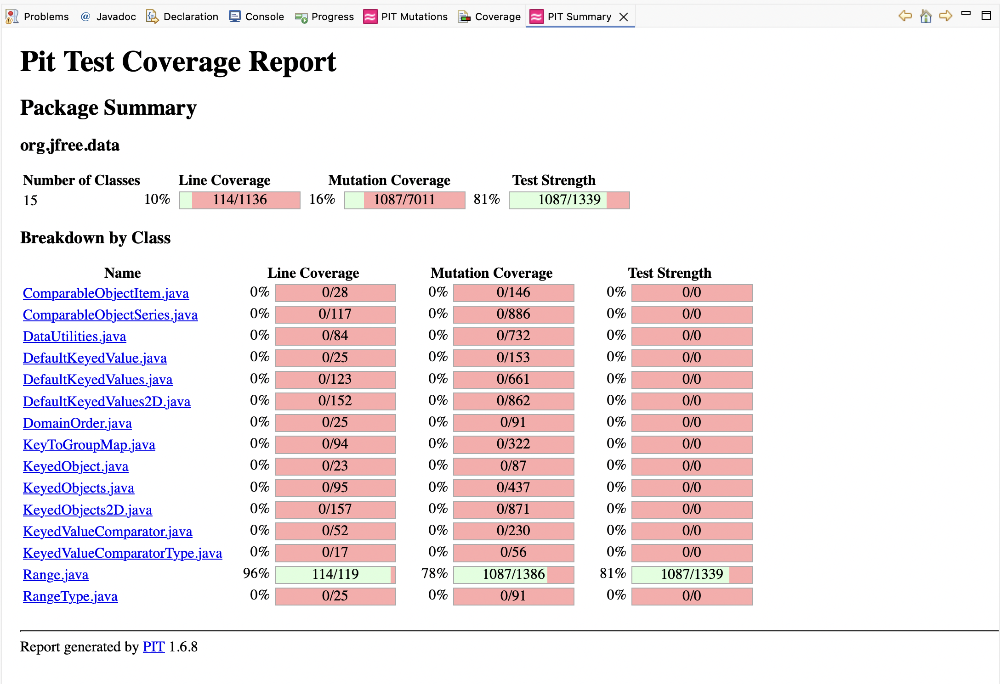

#### Mutation statistics
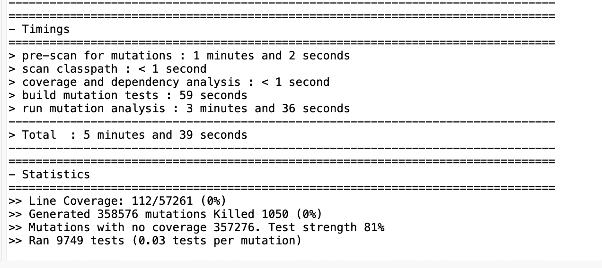
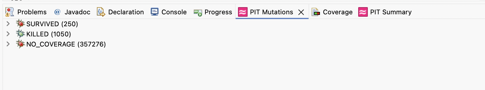

## 3.1 DataUtilities class
### 3.1.1 Before
#### Mutation score
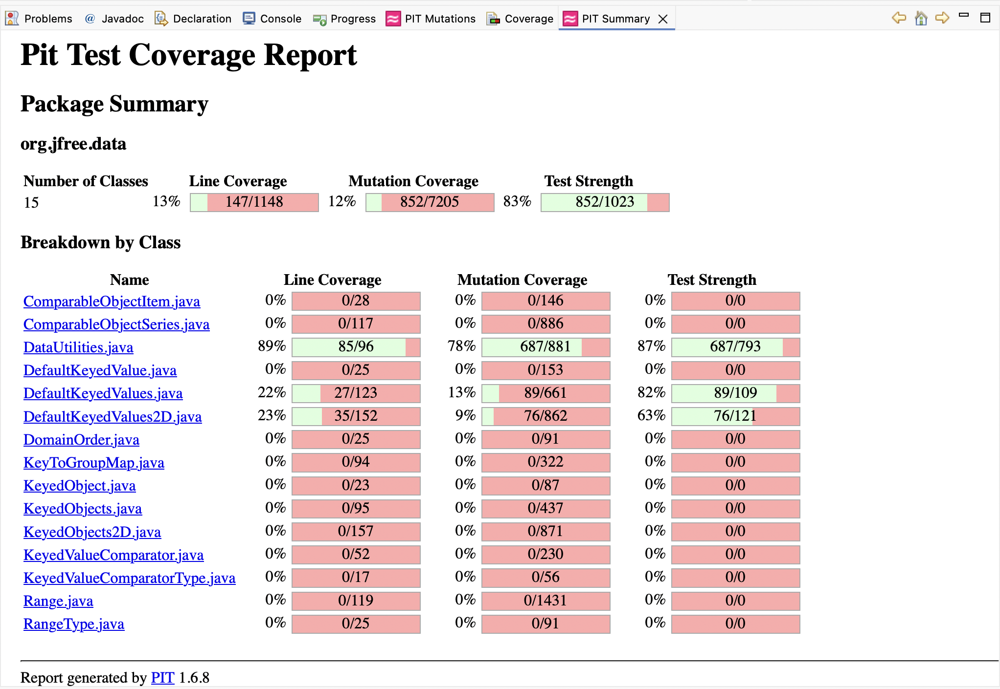

#### Mutation statistics
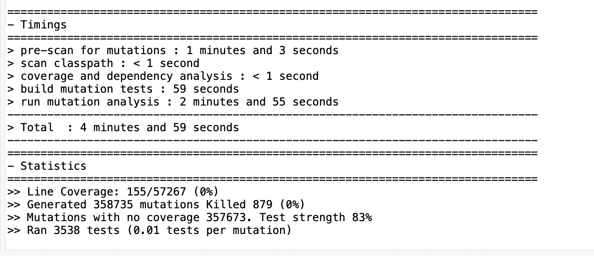

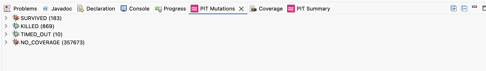

### 3.1.2 After
#### Mutation score
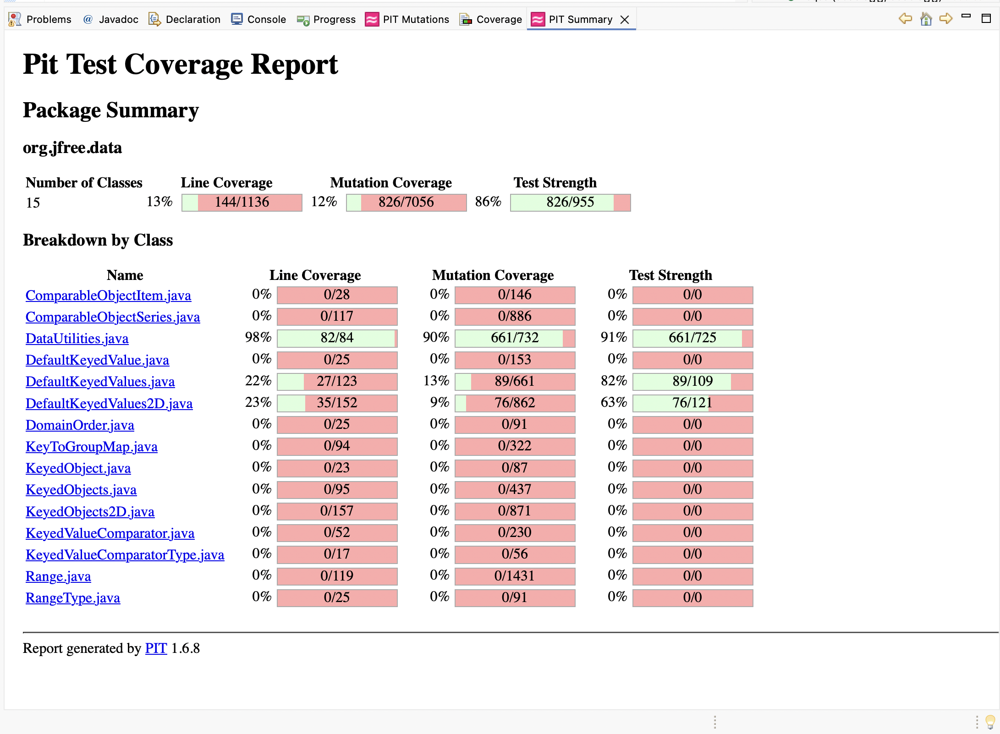

#### Mutation statistics
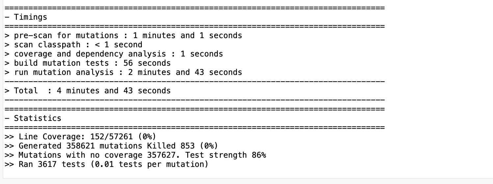

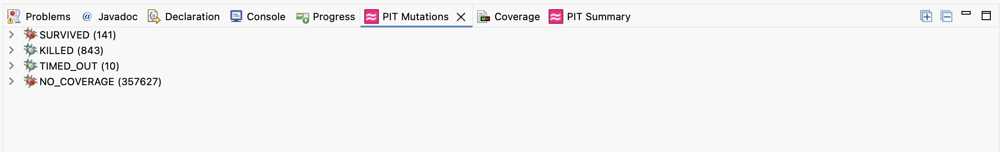

# 4. Analysis drawn on the effectiveness of each of the test classes 
* Analysis of the PIT reports for both the Range and DataUtilities classes revealed that most surviving mutants were due to equivalent mutations, leaving little room for improving the mutation scores.
* Furthermore, we removed dead code that contains no coverage, which incread the coverage in the source code.
* We tried to create tests focusing on no coverage, but after careful examination, we noticed some dead code, we removed them, it increased the coverage.
* private methods also reported in the coverage
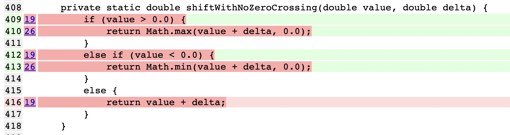
* Constructor gets the coverage 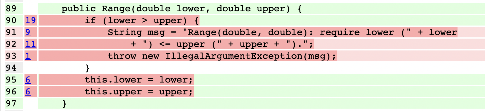
* Coverage for private methods, and constructor causes a drop in the mutation score.

# 5. A discussion on the effect of equivalent mutants on mutation score accuracy
## Equivalent mutants in mutation score accuracy
Equivalent mutants are mutations that do not change the observable behavior of a program, meaning no test case can distinguish them from the original code. Their presence can reduce the accuracy of mutation scores because surviving equivalent mutants are counted as undetected faults, even though the test suite may be strong. This can give a misleading impression that the tests are weak or incomplete, highlighting the need for careful analysis of surviving mutants when interpreting mutation scores.

## An example from Range.shift method
For the **shift(Range base, double delta, boolean allowZeroCrossing) method**, most mutations such as negating the conditional on allowZeroCrossing or replacing arithmetic in base.getLowerBound() + delta—are killed by existing tests. However, some mutants like incrementing or decrementing the local double variables survived. These surviving mutants are likely equivalent because small changes to the local variables do not affect the returned Range in a way that is observable by the current tests. This example illustrates how equivalent mutants can survive without indicating actual test weaknesses, directly impacting mutation score interpretation.

## Automatically detect equivalent mutants
Automatically detecting equivalent mutants is challenging because it requires reasoning about which changes do not affect the behavior.

Consider this part of the shift method:
```
if (allowZeroCrossing) {
    return new Range(base.getLowerBound() + delta,
                     base.getUpperBound() + delta);
} else {
    return new Range(shiftWithNoZeroCrossing(base.getLowerBound(), delta),
                     shiftWithNoZeroCrossing(base.getUpperBound(), delta));
}
```
From the mutant logs, we have several mutants like:

* Mutant 10: Incremented (a++) double local variable number 3 - SURVIVED
* Mutant 11: Decremented (a--) double local variable number 3 - SURVIVED

These correspond to changes in local variables (doubles used in calculations) that do not affect the returned Range object for any input. They are essentially equivalent mutants, because no matter what value we give for base or delta, the final lower and upper bounds of the returned Range remain the same.

One potential approach we can consider is the use of **symbolic execution**, which is widely used in program verification and software security testing in both academia and industry.

We could try out this process with the core elements of the above mention approach:
1. Symbolically track variable usage:
* Treat inputs (base.lower, base.upper, delta, allowZeroCrossing) and local variables as symbolic values.
* Identify which local variables actually contribute to the returned Range (i.e., used in new Range(...) computations).
* If a mutation (like a++ or --a on a local double) changes a variable that does not affect the final lower or upper bounds, mark the mutant as equivalent.

2. Path-sensitive analysis:
* Explore both branches of the allowZeroCrossing conditional.
* Ensure that mutations are tested along all possible execution paths.
* Mutants that never influence the output in any path are considered equivalent.

Furthermore, we thought about this approach's pros, cons, and assumptions:
* Benefits: improves mutation score accuracy, and minimizes manual inspection.
* Disadvantages: Computationally expensive, path explosion in methods with multiple conditionals, and handling floating-point precision can be challenging.
* Assumptions: All relevant input ranges are considered.


# 6. A discussion of what could have been done to improve the mutation score of the test suites
* We can add test cases for all the public methods in both classes.
* We could find a way to test constructors (if possible), and focus on private methods in the classes
* We could find out a good way to cover equivaluent mutants via tests, and ensure increase the test score.

# 7. Why do we need mutation testing? Advantages and disadvantages of mutation testing

# 8. SELENUIM test case design process
First, we decided to test Amazon website using the Selenium IDE.

After choosing Amazon as our SUT, we decided what all functionalities should be part of the test cases. We decided to test those functionalities that might be used most often by the user (excluding purchases). With this in mind, we had envisioned our user to conduct the following actions on the website

- Product search: verifying that entering keywords returns relevant results and loads the results page correctly
- Filter products: verifying that applying filters (e.g., price, brand, rating) updates the product list based on selected criteria
- Sort by price/rating: verifying that sorting options correctly reorder products according to the selected metric
- Switch language and currency: verifying that changing settings updates interface text and displayed prices consistently across the site
- Add to Cart: the core e-commerce conversion action, verifying the cart state changes after clicking Add to Cart
- Product Detail Page: verifying that a product page renders all required components (title, price, rating, wishlist, images)
- Department/Category Navigation: testing the site's category taxonomy (Electronics department, Books department with search-within)
- Customer Reviews: verifying review filtering by star rating and review section rendering on product pages

After defining the list of actions that a user will conduct in our test scenario, we then progress to creating test cases for these actions to verify the functionality works according to the expectations.

For example, with product search, we would define test cases to verify that entering a keyword on Amazon returns relevant results and successfully loads the results page.

The selenium IDE recorded test cases are [here](Selenium_Test.side).

# 9. The use of assertions and checkpoints

Assertions and checkpoints are used to verify at specific points of the test cases that the functionality is working as intended.

For example, for the test cases with the search product, we asserted the number of items in the cart shown on the site with the number of items that we actually added. Likewise, we assert the label "Empty Cart" when we have removed all of the items to ensure that the cart is working as expected.

In the Selenium IDE, these functionalities are implemented using `assert` and `verify` commands (and their derivatives such as `assertElementPresent` for stable structural elements). According the [official Selenium IDE documentation](https://www.selenium.dev/selenium-ide/docs/en/api/commands), the test case stops if the `assert` fails, but continues even if `verify` fails.

| Test script name                |     Checkpoints | Example of automated verification checkpoint                                                                 |
|------------------------------------|------------------------------------|-------------------------------------------------------------------------------------------------------------|
| Search Valid Product               |(1) Results container loaded; (2) At least one result exists; (3) Keyword appears in page/title; (4) Prices visible| Verifies search results exist and keyword appears in page content                                            |
| Search Invalid Product             |(1) Results container loaded; (2) “No results” / fallback message shown; (3) Zero exact matches or corrected results |Verifies “no results” or fallback message is displayed                                                       |
| Click First Product                |(1) Navigated to /dp/ page; (2) Product title present; (3) Price element exists; (4) Add-to-cart button exists|Verifies navigation to product detail page and product title/price are present                              |
| Filter by Prime                    |(1) Refinement panel present; (2) Prime filter applied; (3) Results exist after filtering; (4) Prime badge/text visible|Verifies Prime filter applied and Prime badge appears in results                                             |
| Filter by Price Range              |(1) Refinement panel present; (2) Price range applied (URL/text); (3) Filtered results exist; (4) Prices rendering|Verifies price range parameters reflected and filtered results displayed                                    |
| Filter by Brand                    |(1) Refinement panel present; (2) Brand selected; (3) Results exist after filter; (4) Brand appears in page/refinement|Verifies selected brand is applied and results update accordingly                                            |
| Sort by Price Low to High          |(1) Results loaded; (2) Sort param in URL; (3) Results exist; (4) First two prices ascending|Verifies URL contains ascending sort parameter and first two prices are in increasing order                 |
| Sort by Price High to Low          |(1) Results loaded; (2) Sort param in URL; (3) Results exist; (4) First two prices descending|Verifies URL contains descending sort parameter and first two prices are in decreasing order                |
| Sort by Average Customer Review    |(1) Results loaded; (2) Sort param in URL; (3) Results exist; (4) Star ratings visible|Verifies rating-based sorting applied and star ratings are visible                                           |
| Sort by Featured                   |(1) Results loaded; (2) Featured sort in URL; (3) Results exist; (4) Titles & prices present|Verifies featured sort applied and results contain product titles and prices                                |
| Switch Language to French          |(1) Page loads; (2) Language set to French; (3) Navigation bar present; (4) Search bar present|Verifies page content changes to French (e.g., “Panier”, “Compte et listes”)                                |
| Switch Language Back to English    |(1) Page loads; (2) Language set to English; (3) French text removed; (4) Navigation bar present|Verifies page content switches back to English and French text is no longer present                         |
| Verify Currency Displays in CAD    |(1) Results loaded; (2) Price elements exist; (3) Currency symbol is $; (4) Not USD-only display|Verifies product prices display CAD symbol ($) and not exclusively USD                                      |
| Add Single Item to Cart (Headphones) | (1) Results loaded; (2) On /dp/ page; (3) Add-to-Cart button exists; (4) Cart contains items after action|Verifies cart contains at least one item after clicking Add to Cart                                         |
| Add Item to Cart then View Cart (Keyboard) | (1) Search results present; (2) Add-to-Cart exists; (3) Cart page loaded; (4) Subtotal element present |Verifies cart page loads and subtotal is present, confirming item added                                     |
| Product Detail Page: Title, Price, Rating (Laptop) |(1) Title element present; (2) Title text non-empty; (3) Price element exists; (4) Star rating exists|Verifies product title, price element, and rating are present on product page                               |
| Product Detail Page: Wishlist Button (Monitor) |  (1) Title present; (2) Wishlist button exists; (3) Image gallery exists; (4) URL still on /dp/ |Verifies wishlist button and product images are present on product detail page                              |
| Department Navigation: Browse Electronics |  (1) Homepage logo loaded; (2) Results slot present; (3) At least one result; (4) URL confirms department; (5) Refinements panel present|Verifies navigation to Electronics category and products are displayed                                      |
| Department Navigation: Browse Books  |  (1) Results loaded; (2) Products present; (3) URL confirms books category; (4) Refinements panel present; (5) Search within department works|Verifies Books category loads and search within department works correctly                                  |
| Customer Reviews: Filter by 4-Star and Above |  (1) Results loaded; (2) Refinements panel present; (3) Filter applied via URL; (4) Products displayed; (5) Rating elements visible |Verifies rating filter applied via URL and results contain rating elements                                  |
| Customer Reviews: Read Reviews on Product Page | (1) On /dp/ page; (2) Rating summary present; (3) Review count visible; (4) Histogram exists; (5) Individual reviews displayed |Verifies review section, rating summary, and individual reviews are displayed  |

Limitation encountered: Selenium IDE has a limitation when testing the cart count badge for guest users because Amazon only updates this number after a user logs in, making it impossible to verify automatically in this context. To address this, the test was redesigned to navigate directly to the cart page (`/gp/cart/view.html`) after adding an item, where the presence of the product can be reliably checked. This workaround allows automated verification to proceed, but it also highlights a disadvantage of Selenium IDE, its difficulty in testing features that depend on login or session state when no test account is available.

# 10. Test each functionaity with different test data
Each of the eight functionalities/test chosen was tested with different test data using Selenium IDE. The table below summarizes tests and test data that was used during testing.

| **Test**                            | **Test Data**                     |
| ----------------------------------- | --------------------------------- |
| Search Valid Product             | laptop                            |
| Search Invalid Product           | asdkfjaskdf99999zzz               |
| Click First Product              | headphones (search results)       |
| Filter by Prime                  | monitor                           |
| Filter by Price Range            | monitor (price range: $100–$500)  |
| Filter by Brand                  | bluetooth speaker                 |
| Sort by Price Low to High        | keyboard                          |
| Sort by Price High to Low        | keyboard                          |
| Sort by Average Customer Review  | headphones                        |
| Sort by Featured                | laptop                            |
| Switch Language to French       | language = fr_CA                  |
| Switch Language Back to English | language = en_CA                  |
| Verify Currency Displays in CAD | laptop (currency symbol: $ / CAD) |
| Add Single Item to Cart (Headphones)                 | headphones                              |
| Add Item to Cart then View Cart (Keyboard)           | mechanical keyboard                     |
| Product Detail Page: Title, Price, Rating (Laptop)   | laptop                                  |
| Product Detail Page: Wishlist Button (Monitor)       | computer monitor                        |
| Department Navigation: Browse Electronics            | electronics                             |
| Department Navigation: Browse Books                  | bestseller / python programming (books) |
| Customer Reviews: Filter by 4-Star and Above (Mouse) | wireless mouse (4-star and above filter)  |
| Customer Reviews: Read Reviews (Earbuds)             | bluetooth earbuds                       |


# 11. Selenium vs Sikulix

# 12. Selenium IDE outdated

# 13. Division of team work

# 14. Difficulties encountered, challenges overcome, and lessons learned

# 15. Comments/feedback on the assignment itself
